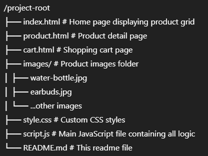

# ecom-prod-page

## Overview

MyShop is a lightweight and user-friendly web application that allows users to browse products, view detailed product information, add items to a shopping cart, and manage their cart with quantity updates and item removal. It uses **localStorage** to persist cart data locally and leverages **jQuery** and **Bootstrap 5** for UI and interactions.

---

## Features

- Display a product catalog with images, names, prices, and descriptions.
- Navigate to a product details page for more information and purchasing.
- Add products to the shopping cart with selectable quantity.
- View cart contents on a dedicated cart page.
- Remove items from the cart dynamically.
- Cart data persists in browser's localStorage.
- Responsive design using Bootstrap grid system.

---

## Technologies Used

- HTML5 & CSS3
- Bootstrap 5 (CSS framework)
- JavaScript (ES6+)
- jQuery (DOM manipulation and event handling)
- Browser LocalStorage (to save and retrieve cart data)

---

## File Structure

---

## How to Use

1. **Open `index.html`** in your browser to view the product catalog.
2. Click on a product card (except the Add to Cart button) to go to the product detail page.
3. Select quantity and click **Add to Cart** either from the product grid or product detail page.
4. Go to the **Cart** page by clicking the "Cart" link in the navigation bar.
5. View all added products, their quantities, prices, and total cost.
6. Use the **Delete** button to remove items from your cart.
7. Cart contents are saved locally and persist on page reload.

---

## Customization

- **Add or remove products:** Modify the `products` array in `script.js`.
- **Change styling:** Update or extend `style.css` or Bootstrap classes.
- **Enhance functionality:** Add features like user authentication, checkout, or backend integration.

---

## Future Improvements

- Implement user login and persistent server-side cart.
- Add product categories and filters.
- Enable quantity editing directly in the cart.
- Provide checkout and payment gateway integration.
- Improve accessibility and SEO.

---

## Credits

- Product images sourced locally (replace with your own).
- Bootstrap 5 (https://getbootstrap.com/)
- jQuery (https://jquery.com/)

---

## License

This project is open-source and free to use and modify.

---

Feel free to reach out for any questions or contributions!

---

_Created by [@DevAT](https://github.com/DevAdvait)- 2025_
